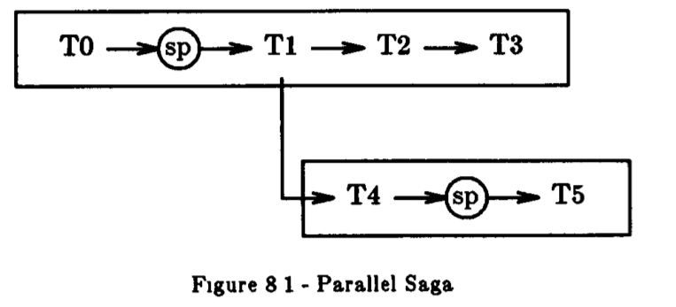

# **Sagas**

## 摘要

**长事务(Long ived transactions(TTLs))**会占用数据库资源相对较长的时间，它显著的延迟了较短的且更为通用的事务	为了缓解这种问题，我们提出了Saga这个概念	如果一个**长事务**可以分解成一个事务序列进行顺序执行，那么这个模式就是saga	数据库管理系统需要保证所有在saga中的事务全部执行成功或者是运行补偿事务来回滚部分执行成功的事务	saga 的概念和它的实现都比较简单，但是它们有潜力极大地提高性能	我们分析了与saga相关的各种实现问题，包括如何在不直接支持它们的现有系统上运行它们	我们还讨论了关于数据库和**长事务**设计的技术，这些技术使得将**长事务**分解为saga成为可能

## 1. 简介

顾名思义，**长事务**也是一种事务，这种事务即使在没有其他事务的干扰下，他的执行也会花费大量时间，可能几分钟几小时甚至几天	**长事务**相较于其他的事务具有相对较长的执行时间和持续时间，因为它可能会访问许多数据库对象，或者它具有冗长的计算，或者它为来自用户的输入而暂停，或者是这些因素的组合	**长事务**的示例包括在银行生成月度账报表的交易记录，或者在保险公司处理索赔的交易以及在整个数据库中收集统计数据的交易

在大多数情况下，**长事务**存在严重的性能问题	由于它们是事务，系统必须将它们作为原子操作执行，从而保持数据库的一致性	为了使事务具有原子性，系统通常会锁定事务访问的对象，直到它提交为止，而这通常发生在事务结束时	因此，当其他事务希望访问**长事务**中的对象时会遭受较长的锁定延迟	因为**长事务**执行流程很长并且因为它们需要访问许多数据库对象，那么会导致其他事务也可能遭受更高的阻塞率，即相对于短事务，**长事务**更可能与**长事务**发生冲突

此外，**长事务**也会提高事务的终止率	正如文中所讨论的，死锁频率对事务的“大小”非常敏感，即对访问多少对象事务（在分析死锁频率随事务大小的四次方增长）	因此，由于**长事务**访问了许多对象，它们可能会导致许多死锁，并相应地导致许多中止	从系统崩溃的角度来看，**长事务**遇到故障的可能性更高（因为它们的持续时间），因此更有可能遇到更多延迟并且更有可能自行中止

一般来说，没有解决**长事务**问题的解决方案	即使我们使用不同的锁机制来确保 **长事务** 的原子性，但长时间的延迟和/或高中止率仍将会大量存在	无论机制如何运作，一个需要访问**长事务**访问的对象的事务在该**长事务**提交之前都无法提交

但是，对于特定应用程序，可以通过放宽将**长事务**作为原子操作执行的要求来缓解问题	换句话说，在不牺牲数据库一致性的情况下，某些**长事务**可能会在它们完成之前释放它们的资源，从而允许其他等待的事务继续进行

为了说明这个想法，考虑一个航空公司预订应用程序	数据库（或实际上是来自不同航空公司的数据库的集合）包含航班预订，事务 T 希望进行多个预订	对于本次讨论，让我们假设T是 **长事务**（假设在每次预订后暂停以等待客户输入）	在这个应用程序中，T 可能没有必要在完成之前保留它的所有资源	例如，T在F1航班上预订座位后，它可以立即允许其他事务预订同一航班上的座位	换句话说，我们可以将 T 视为“子事务” T1、T2、... Tn 的集合，它们保留了各自的座位

但是，我们不希望将 T 简单地作为独立事务的集合提交给数据库管理系统 (DBMS)，因为我们仍然希望 T 是一个成功完成或根本没有完成的整体	我们不希望 T 保留五个席位中的三个然后（由于崩溃）导致DBMS 什么都不做	另一方面，我们希望DBMS 能够保证 T 将所有预定都成功，或者如果 T 必须停止，那么也将取消所有已预定座位

此示例表明，与传统原子事务相比，这种控制机制不那么严格，但仍然提供了一些保证措施，保证**长事务**是可以实现的	在本文中，我们将介绍一个这样的机制

让我们使用术语 **saga** 来指代**长事务**，它可以将一个**长事务**分解为多个子事务	这些子事务可以和其他事务交织在一起	在这种情况下，每个子事务都是一个真正的事务，因为它保留了数据库的一致性	然而，与其他事务不同，**saga** 中的事务是相互关联的，应该作为（非原子）单元执行：**saga** 的任何部分执行都是不被允许的，如果发生，必须进行补偿。

为了能够修正部分执行的问题，每个saga事务Ti都应该提供一个补偿事务 Ci	从语义的角度来看，补偿事务撤消了 Ti 执行的任何操作，但不一定将数据库返回到 Ti 开始执行时存在的状态	在我们的航空公司示例中，如果 Ti 在航班上预订了座位，则 Ci 可以取消预订（例如，通过从预订数量中减去 1 并执行一些必要的检查）	但是 Ci 不能简单地将 Ti 运行时存在的座位数量存储在数据库中，因为在 Ti 预订座位和 Ci 取消预订之间可能运行了其他事务并且可能已经更改了该航班的预订数量。

一旦将 saga 的 T1, T2, ..., Tn 的补偿事务定义为 C1, C2, ..., Cn-1 ，那么这个系统需要作出如下保证	任何一个序列都是这样执行的：

> T1, T2, ..., Tn
> 或者
> T1, T2, ..., Tj, Cj, ..., C2, C1

对于0 ≤ j < n 将被执行。（请注意，当运行补偿事务Ci时其他事务可能会受到部分saga执行的影响，在Ci补偿之前，不会努力通知或中止可能已经看到Ti结果的事务）

Sagas 是一种相对常见的 **长事务**类型	当**长事务**由一系列相对有序且独立的步骤组成时，每一步不必关注于全局一致性	例如，在银行中，对所有账户执行固定操作（例如计算利息）是很常见的，并且一个账户和下一个账户的计算之间几乎没有交互	在办公室信息系统中，具有独立步骤的 **长事务** 也很常见，这些步骤可以与其他事务的步骤交错使用	例如，接收采购订单涉及将信息输入数据库、更新库存、通知会计、打印运输订单等	这类模拟办公**长事务**的程序，可以应对交错的事务	实际上，在采购订单成功前，人们不会锁定库存，因此在那些完成之前没必要让计算机程序锁定库存

再次说明，我们提出的银行和办公室的**长事务**例子不仅仅是一些正常事务的集合，他们是一个 sagas	有一个应用程序“约束”（不能用数据库一致性约束来表示）这些步骤不应该只完成一部分	这个应用程序需要能够处理所有的账户，或保证购买订单完全处理	如果采购订单未成功完成，那么这些相关记录必须被矫正（例如库存不应该被扣减）	在银行的示例中，可能始终可以一直执行直到完成这个**长事务**	在这种情况下，可能没有必要对未完成的**长事务**进行补偿

请注意，saga 的概念与嵌套事务的概念相关。 但是有两个重要的区别：

1. saga 只允许嵌套顶层 saga 和简单事务的两个级别

2. 在外层没有提供完整的原子性。 也就是说，sagas 可以查看其他 sagas 的部分结果

Sagas 也可以被视为在描述的机制下运行的特殊类型的事务	这个约定可以使机制更通用，使 sagas 的实现（和理解）更简单，从而使它们更有可能在实践中被使用

要使我们提出的想法可行，需要两个要素：支持 sagas 的 DBMS，以及长事务可以被分解成有序的事务	在本文的其余部分，我们将更详细地研究这些成分	在第 2 节到第 7 节中，我们将会研究 saga 处理机制的实现	我们首先讨论应用程序程序员如何定义 saga，然后系统如何支持它们	我们最初假设只有遇到系统故障才能进行补偿事务	稍后, 在第6节中, 我们将研究其他故障 (例如程序错误) 在补偿事务中的影响

在第 8 节和第 9 节中，我们将讨论 **长事务**的设计。 我们首先表明，我们的 saga 顺序事务执行模型可以推广到包括并行事务执行，从而包括更广泛的 **长事务**	然后，我们讨论程序员可能遵循的一些策略，以便将一个**长事务**编写成 saga并取得一定的效果

## 2.用户设施

从程序员的角度来看，需要一种机制来通知系统 saga 的开始和结束、以及每个事务的开始和结束以及补偿相应的事务。 这种机制可能类似于传统系统中用于管理事务的机制

特别是，当一个应用程序希望启动一个saga时，它就会向系统发出一个 **begin saga** 的命令。接下来是一系列的**开始事务**、**结束事务**的命令，每一组开始、结束事务的指令，都表示着每个事务的边界。在这些命令之间，应用程序将发出传统的数据库访问命令。在事务中，程序可以选择通过发出中止事务（abort-transaction）命令，这将中止当前正在执行的事务，但不会中止 saga。类似地，有一个中止saga（abort-saga）的命令：首先中止当前正在执行的事务，然后中止整个saga（通过执行补偿事务）。最终，还有一个结束saga（end-saga）的命令，用于提交当前正在执行的事务（如果有）并且完成这个saga。

这些命令中的大多数将包括各种参数。 begin-saga命令可以将saga标识符返回给程序。 然后，该标识符可以在saga进行的后续调用中传递给系统。abort-transaction命令包含在事务中止后saga从哪里继续执行的地址作为其参数。end-transaction命令包含当前事务回滚所需补偿事务的标识符，该标识符包括补偿事务的名称与程序入口，以及各种可能会用到的参数。（我们假设每个补偿程序都包含他自己的开始事务和结束事务方法。在补偿事务中，abort-transaction 和 abort-saga 命令不允许执行。）最后，这个 abort-saga 命令可能包含着一个存储点作为参数，如下所述。

请注意，可以让每个事务在数据库中存储其补偿事务将来可能需要的参数。在这种情况下, 参数不必由系统传递, 它们可以在补偿事务启动时被读取。另请注意, 如果end-saga 命令同时结束最后一个事务和saga, 则无需为最后一个事务进行补偿事务。如果改为使用单独的最终事务，则必须包括补偿事务的标识。

在某些情况下，可能需要让应用程序程序员通过 save-point 命令指示应该在哪里进行 saga 检查点。该命令可以在事务之间发出。它强制系统保存正在运行的应用程序的状态并返回一个保存点标识符以供将来参考。这样, 保存点就可以帮助减少 saga故障或系统崩溃后的工作量：系统可以补偿自上次保存点以来执行的事务，而不是补偿所有未完成的事务，然后重新启动 saga .

当然，这意味着我们现在可以执行 T1、T2、C2、T2、T3、T4、T5、C5、C4、T4、T5、T6 。 （第一次成功执行T2后，系统崩溃了。T1之后已经取了一个savepoint，但是这里要重新启动，系统首先通过运行C2撤消T2。然后可以重新启动saga并重新执行T2。在执行T5之后发生了第二次失败。）这意味着我们必须修改上面给出的有效执行序列的定义以包含此类序列。 如果这些部分恢复序列无效，那么系统要么不获取保存点，要么在每个事务的开始（或结束）自动获取它们。

我们到目前为止所描述的模式是通用的, 但在某些情况下, 可能更容易使用限制性更强的模型。我们将在第5节后面讨论这种限制性模型。

## 3.可靠地保存代码

在一个传统事务处理系统, 不需要应用程序代码就可以在崩溃后将数据库还原到一致的状态。如果一个正在运行的事务代码遭到破坏而终止, 系统日志中包含足够的信息来撤消事务的影响。在 saga 处理系统中，情况就不同了。要在崩溃后完成正在运行的 saga，必须完成丢失的事务或运行补偿事务以中止 saga。 无论哪种情况，都必须拥有所需的应用程序代码。

使用抽象数据类型的事务系统面临着类似的问题。恢复抽象数据对象涉及该数据类型上的日志记录操作（和逆操作），而不是旧值和新值。因此，如果要在崩溃后将数据库恢复到一致状态，则实现这些操作的代码必须存在。

> 下面是为了能够妥善的保存saga的处理代码的一些解决方案

这个问题有多种可能的解决方案。 一种是像在常规系统中处理系统代码那样处理应用程序代码。请注意, 即使传统的DBMS不需要可靠地保存应用程序代码, 它也必须保存系统代码。也就是说, 如果故障破坏了运行系统所需的代码, 则传统的 DBMS无法重新启动。因此, 传统系统会有手动或自动的外部程序用于备份DBMS中的数据。（个人理解：使用一个外部应用用于保存saga的处理代码）

在saga处理系统中, 我们可以要求以相同的方式定义和更新saga的应用程序代码。创建的程序的每个新版本都将存储在当前系统区域以及一个或多个备份区域中。由于更新不在DBMS的控制之下, 因此它们不是原子操作, 并且可能需要手动干预, 以防在更新过程中发生崩溃。当一个saga开始运行时, 它将假定它的所有事务和补偿事务都已预定义, 它只会进行适当的调用。

如果 sagas 是由受信任的应用程序程序员编写的, 并且不是经常更新, 则这种方法可能是可以接受的。如果不是这种情况, 最好将saga代码作为数据库的一部分来处理。如果saga代码只是作为一个或多个数据库对象存储, 则其恢复将是自动的。唯一的缺点是 dbms 必须能够处理大型对象（即代码）。有些系统不会能够做到这一点, 因为他们的数据模型不允许大的非结构化的对象, 缓冲区管理器不能管理跨越多个缓冲区的对象, 或其他一些原因。

如果 dbms 可以管理代码, 那么 sagas 的可靠代码存储就变得非常简单。saga 的第一个事务T1将未来可能需要的所有进一步事务（补偿或不补偿）输入数据库。当 T1提交，saga的其余部分就可以开始了。T1的补偿事务C1只需从数据库中删除这些对象也可以定义增量事务。例如，补偿事务 Ci 在其对应的事务 Ti 准备好提交之前不需要保存到数据库。 这种方法稍微复杂一些，但节省了不必要的数据库操作。

## 4. 回滚恢复

当一个故障中断一个 saga 时，有两种选择：补偿执行的事务回滚恢复或执行丢失的事务向前正向恢复。 (当然，前向恢复可能不是在所有情况下都可以选择。)对于回滚恢复，系统需要补偿事务, 对于恢复, 系统需要保存点。在本节中, 我们将介绍如何实现纯回滚恢复, 后面再讨论混合回滚正向和纯正向恢复。

在DBMS中, saga执行组件 (Saga Execute Component(SEC)) 管理着saga。此组件调用常规事务执行组件 (Transaction Execute Component(TEC)), 该组件管理各个事务的执行。SEC 的操作类似于 TEC: SEC作为一个单元执行一系列事务, 而TEC作为一个 (原子) 单元执行一系列操作。这两个组件都需要一个日志来记录 sagas 和事务的活动。事实上, 将这两个日志合并为一个日志是很方便的, 我们将假设这里的情况就是这样。我们还将假设日志是双重的可靠性(即存在备份)。请注意, SEC不需要并发控制, 因为它控制的事务可以与其他事务交错。

所有 saga 命令和数据库操作都通过 SEC 传输。在执行任何操作之前, 每个 saga 命令 (例如 begin-saga) 都会记录在日志中。命令中包含的任何参数（例如，结束事务命令中的补偿事务标识）也记录在日志中。begin-transaction 和 end-transaction 命令以及所有数据库操作都被转发到 TEC，TEC 以传统方式处理它们。

当 SEC 收到 abort-saga 命令时，它会启动回滚恢复。为了说明，让我们考虑一个已执行了T1和T2事务的saga。并且在 T3 执行的中途向 SEC 发出 abort-saga 命令。SEC 将命令记录在日志中（以防止回滚期间崩溃），然后指示 TEC 中止当前事务 T3。 该事务使用传统技术回滚，例如，通过将“之前”值（在日志中找到）存储回数据库中。

接下来，SEC会查询日志，并命令执行补偿事务C2和C1，如果这些事务的参数在日志中，则会使用这些参数。这两个补偿事务执行方式就像其他事务一样，当然，关于他们何时开始和提交的信息记录到日志中取决于TEC。（如果在此期间出现崩溃，系统将能够知道还有哪些工作要做。）当C1提交后，这个saga将会终止。日志中会记录一个信息，类似于由结束saga的命令创建的信息。

该日志还用于从崩溃中恢复。 崩溃后，首先调用 TEC 来清理挂起的事务。一旦所有事务被中止或提交，SEC 就会评估每个 saga 的状态。如果 saga 在日志中有相应的 begin-saga 和 end-saga 条目，则 saga 已完成，无需进一步操作。如果缺少 end-saga 条目，则 saga 被中止。通过扫描日志, SEC 发现了最后一次成功执行并且没有补偿的事务，为该事务和所有之前的事务运行补偿事务。

## 5.正向恢复

对于正向恢复，SEC要求所有缺失的事务都有可靠的代码副本和一个保存点。这个保存点会被用于应用程序或者系统，具体取决于是哪个中止了saga。（回忆一下，存储点标识符可以作为参数传递到 abort-saga 命令中。）在一个系统崩溃的情况中，恢复组件可以为每个saga指定最近期的保存点。

为了说明SEC在这种情况下的操作，请考虑一个执行了事务T1，T2，并再执行T2后保存了一个保存点，然后又执行了事务T3。然后在执行T4时系统崩溃了。恢复后，系统必须首先执行一个回滚恢复到保存点（中止T4并且运行补偿C3）。确保代码运行T3、T4、等等后续事务是可用的之后，SEC在日志中记录了它决定重启saga，我们叫这种为混合恢复。

如第2节所述, 如果在每次事务开始时自动获取保存点, 则纯正向恢复是可行的。如果我们同时禁止使用 abort-saga 命令, 那么就没有必要执行回滚恢复。(abort-transaction命令仍然是可以接受执行的。）这样做的好处是消除了补偿事务, 在某些应用程序中可能很难编写 (见第9节)。

在这种情况下，SEC成为一个简单的“持久”事务执行器，类似于持久性消息传输机制。每次崩溃后，对于每个活动的saga，SEC指示TEC中止最后执行的事务，然后在此事务开始时重新启动 saga。

如果我们只将saga视为包含对各个事务程序的一系列调用的文件，我们可以进一步简化这一过程。 这里不需要显式的开始或结束 saga，也不需要开始或结束事务命令。 saga从文件中的第一个调用开始，到最后一个调用结束。 此外，每次调用都是一次事务。 正在运行的saga的状态只是正在执行的事务的编号。 这意味着系统可以在每次事务后以很少的成本获取保存点。

这种纯的正向恢复方法对于总能成功的简单**长事务**非常有用。 计算账户利息可能是此类**长事务**的一个例子。 单个帐户的利息计算可能失败（通过中止事务命令），但其余计算将不受影响。

使用操作系统术语，上述事务文件模型可以称为简单的可执行文件或脚本文件。 持久性脚本文件的想法在操作系统中也很有用，以确保成功执行命令集合（假设每个命令作为事务执行）。 例如，典型的文本处理和打印作业包括几个步骤（例如，在UNIX中，方程处理，转发，打印）。 每个步骤都会生成一个或多个由以下步骤的可执行文件。 持久性脚本文件将允许用户启动长文本处理作业然后回家，相信系统会将它完成。

在这种情况下, 我们还必须假设, 在saga中的每一个子事务如果它被重试足够多的次数，最终将会成功。

## 6. 其他错误

到目前为止，我们假设用户提供的补偿事务代码中没有错误。 但是如果由于错误而无法成功完成补偿事务（例如，它尝试读取不存在的文件，或者代码中存在错误）会发生什么？ 事务可能会中止，但如果它再次运行，它可能会遇到相同的错误。 在这种情况下，系统卡住：它不能中止事务，也不能完成它。 如果在纯正向补偿方案中事务有错误，同样会出现类似情况。

一种可能的解决方案是使用类似恢复块（recovery blocks）的软件容错技术。 恢复块是在主块中检测到故障的情况下提供的备用或辅助代码块。 如果检测到故障，则系统重置为其原始状态，并执行辅助块。 辅助块旨在使用不同的算法或技术实现与主要逻辑相同的结果，希望规避掉主流程的故障。

恢复块的想法很容易转化为saga框架。事务是自然的程序块, 由 TEC提供失败事务的回滚功能。saga应用程序可以控制恢复块的执行。 中止事务 (或通知其事务已中止) 后, 应用程序要么中止saga, 要么尝试另一个事务, 要么重试主事务。请注意, 补偿事务也可以为其提供备用事务, 以使中止 sagas 更可靠。

这个问题的另一个可能的解决方案是人工干预。错误的事务首先被中止。 然后将它提供给应用程序程序员，该程序员在给出错误描述后可以纠正它。然后，SEC（或应用程序）重新运行这个事务并且继续处理这个saga。

幸运的是，在手动修复事务时，saga并不持有任何数据库资源（比如锁）。因此，已经时间很长的saga将需要更长的时间，但这不会显著影响其他事务的性能。

依靠人工干预绝对不是一个优雅的解决方案，但它是一个实用的解决方案。剩下的替代方案是将saga作为一个长期的事务来运行。当此**长事务**遇到错误时，它将完全中止，可能会浪费更多的精力。 此外，仍然需要手动更正错误并重新提交 **长事务**。 唯一的优点是在修复期间，系统将不知道 **长事务**。 在这个saga的情况下，在执行完修复的事务之前，saga将继续在系统中挂起。

## 7. 在现有DBMS之上实现SAGAS

在我们对 saga 管理的讨论中，我们假设 SEC 是 DBMS 的一部分并且可以直接访问日志。但是，在某些情况下，是可以在不支持sagas的现有DBMS上运行sagas的，只要数据库能够存储大型非结构化对象（即代码和存储点）。然而，它涉及给应用程序程序员更多的责任，并可能性能。

基本上有两件事要做。首先, 嵌入在应用程序代码中的saga命令成为子程序调用 (相对于系统调用)。(子例程与应用程序代码一起加载。)每个子程序都将数据存储在数据库中，并且sec将会记录这些保存日志。例如, begin-saga 子程序将在活动 sagas 的数据库表中输入该saga的标识。Save-point子程序将会把应用程序的状态 (或其状态的关键部分) 保存在类似的数据库表中。同样, end-transaction子程序在执行结束事务系统调用(由 TEC 处理)之前进入其他一些表, 即结束事务的标识及其补偿事务 。

在数据库中存储saga信息的命令（存储点除外）必须始终在事务中执行，否则信息可能会在崩溃中丢失。因此，saga子程序必须跟踪saga当前是否正在执行事务。如果开始事务设置了一个标志然后被结束事务重置，那么依靠事务是一种很容易实现方式。如果未设置标志，则禁止所有数据库的存储操作。请注意, 子程序方法仅在应用程序代码从不自行进行系统调用的情况下才有效。例如, 如果事务因系统调用end-transaction (而不是子例程调用) 而终止, 则不会记录补偿信息, 也不会重置事务标志。

其次，必须有一个特殊的程序来实现SEC的其他职能。这个程序：saga daemon（SD）将始终处于活跃状态。它在崩溃后会因操作系统而重启。崩溃后，它将扫描saga表，找出挂起状态的sagas。这个扫描将通过提交一个数据库事务来执行。只有在事务恢复完成后，TEC才会执行此事务。 因此，SD将读取一致性的数据。一旦SD知道了待处理的saga的状态，它就会发起必要的补偿或正常的事务，就像SEC恢复后所做的那样。必须注意在SD提交其数据库查询之前，不要干扰sagas崩溃后的正常启动。

在TEC中止事务（例如，由于死锁或用户引起的中止）后，它可能只是中止这个事务的处理。在一个传统的系统，这可能是好的，但在saga中它导致saga其他工作没有完成。如果再这种情况发生时，TEC无法向SD发出信号，则SD必须定期扫描saga表，以发现这种情况。如果发现了，将立即采取纠正措施。

正在运行的saga也可以直接向SD发起请求。例如，若要执行中止saga，这个中止saga子程序将请求发送到SD，然后（如果有必要）执行中止事务。

## 8. 并行SAGAS

我们在saga中执行顺序事务的模型可以扩展到包括并行事务。在saga天然支持并发事务在应用程序中是很有用的。例如，在处理采购订单时，最好同时生成装运订单并更新应收账款。

我们假设saga进程（父进程）可以创建新的进程（子进程），他们可以并行，请求类似于UNIX中的fork请求。该系统还可以提供join功能，以组合saga中的流程。

并发saga的逆向的崩溃恢复类似于有序的sagas。在并发saga中的每个处理，事务都按照相反的顺序进行补偿（或撤销），就像使用有序saga一样。此外，当父进程执行了一些事务后创建了子进程，那么必须将子进程的补偿完成后，才能执行父进程的补偿。 (请注意, 只有有序执行的事务限制了补偿的顺序。如果 T1、T2 已在并行进程中执行, T2 读取了 T1 写入的数据, 补偿了 T1并不强迫我们需要先补偿 T2。)

与反向崩溃恢复不同，从 saga 故障的反向恢复使用并行 saga 更为复杂，因为 saga 可能包含多个进程，所有这些进程都必须终止。为此，通过 SEC 路由所有进程的 fork 和 join 操作很方便，因此它可以跟踪 saga 的进程结构。当其中一个 saga 进程请求 abort-saga 时，SEC 将终止该 saga 中涉及的所有进程。 然后它中止所有待处理的事务并补偿所有已提交的事务。

因为有可能存在“不一致”的保存点，正向恢复更加复杂。为了说明这一点，请思考图8.1中的saga。每个框表示一个进程；每个框都有进程需要有序执行的事务和存储点（SP）。下面的那个进程是在T1提交后fork的。假设T3和T5是当前正在执行的事务，并且保存点在T1和T5之前执行的。

在此时系统失败。上面的进程将会在T1前面重启。因此，第二个进程所做的保存点是没用的。它取决于T1的补偿的执行情况。

此问题称为级联回滚。已经在进程通过消息进行通信的场景中分析了该问题。可以分析保存点依赖关系以得出一组一致的保存点（如果存在）。然后可以使用这组一致的保存点重新启动进程。对于并行 sagas, 情况更加简单, 因为存储点依赖关系仅通过fork和join以及进程中的事务和存储点顺序产生。

为了达到一组一致的保存点，必须再次通知 SEC 进程fork和join。这个信息必须存储在日志中，并在恢复时进行分析。SEC会在saga的每个进程中选择最新的存储点，这样更早的事务就不会补偿。（如果事务在存储点之前执行，但在存储点被加载后，这个事务必须要补偿）。如果程序中没有这样的存储点，则必须回滚整个进程。对于具有存储点的进程，可以进行必要的回滚恢复并重启整个进程。

## 9. 设计SAGAS

我们所描述的 saga 处理机制只有在应用程序程序员将他们的 **长事务** 编写为 saga 时才有用。因此，随之而来的问题：程序员如何知道给定的 **长事务** 是否可以安全地分解为一系列事务？程序员如何选择断点？ 编写补偿事务有多难？ 在本节中，我们将解决其中的一些问题。

要辨别出潜在的子事务，必须寻求正在执行工作的自然划分边界。在许多情况中，**长事务**模型是一系列现实世界的动作，其中每个动作都saga子事务的候选人。例如，当一名大学生毕业后，必须执行几项操作才能颁发毕业证书：图书馆必须检查没有未归还的书籍，必须检查住房账单和学费都核对通过； 必须记录学生的新地址； 等等。 显然，这些现实世界中的每一个动作都可以通过事务来建模。

在其他情况下，是数据库本身被自然地划分为相对独立的组件，并可以将每个组件上的操作分组为saga的事务。例如，考虑一个大型操作系统的源代码。通常操作系统及其程序可以分为调度程序、内存管理器、中断处理程序等组件。一个**长事务**是向操作系统添加一个跟踪工具，这个跟踪工具可以分解到每个组件上，每一个作为有一个事务。同样，如果员工数据可以按工厂位置来切分，那么给员工发放生活费补贴的**长事务**也可以按照工厂位置进行拆分。

为**长事务**设计补偿事务是一个非常普遍的难题。（例如，如果事务触发一枚导弹，则可能无法撤销此操作）。然而，对于许多实际应用来说，它可能和编写事务本身一样简单（或困难）。在应用程序中事务通常有相应配套的补偿事务。特别是类似真实世界的可以撤销的事务模型，例如预定一个出租车或者商场购物下单。在这种情况下，编写补偿事务和编写普通事务非常相似，程序员必须编写执行操作的代码并保证数据库一致性约束。

甚至可以补偿难以撤消的操作，例如发送信件或打印支票。例如，为了补偿这封信，请发送第二封解释问题的信。要补偿支票，请向银行发送停止付款信息。当然，最好不必对此类行为进行补偿。但是，将 **长事务** 作为常规事务运行的代价可能非常高，以至于被迫编写 saga 及其补偿事务。

还记得纯正向恢复不需要补偿事务（参见第 5 节）。 因此，如果补偿事务难以编写，则可以选择定制应用程序，使 **长事务** 不会出现用户发起的中止。 如果没有这些中止，纯正向恢复是可行的，并且永远不需要补偿。

正如我们所讨论的，DB的结构在saga设计中扮演着关键角色，因此最好不要孤立地研究每种**长事务**，而是在设计数据库时就把如何适配**长事务**和saga考虑进去。如果DB能被设计成一套松散链接的组件（加上一点儿简单的组件内一致性约束），那么**长事务**应该就能自然而然地以子事务形式被组织在一起。

正如我们所讨论的，DB的结构在saga设计中扮演着关键角色，因此最好不要孤立地研究每种**长事务**，而是在设计数据库时就把如何适配**长事务**和saga考虑进去。如果DB能被设计成一套松散链接的组件（加上一点儿简单的组件内的一致性约束），那么**长事务**应该就能自然而然地以子事务形式被组织在一起。

另一项对于转换**长事务**而言可能比较有用的手段是将**长事务**所涉及到的临时数据存储在数据库内部。为了说明这点，考虑一个包含三个子事务T1,T2,T3的**长事务**，记为L。在T1中，L执行一些操作，然后从数据库中存储的账户中取出一些钱。这一金额暂时存储在临时本地变量中，直到T3才将这部分钱写入到另一个（或几个）账户里。T1完成后，数据库处于不一致状态：一部分钱“消失”了，即无法在数据库中查到这部分金额。因此，L不能被视为saga运行。如果这样的话，在T1至T3之间运行、需要查询全部金额的操作（例如审计）就无法查询到全部资金了。如果L作为普通事务执行，那么审计操作就需要排队等L结束。这虽保证了一致性但却严重影响了性能。

然而，如果不是将这部分钱存到L本地，而是存到数据库中，那么数据库就一致了，其他事务也可以同时运行。为实现这点，我们必须将【临时存储】概念引入到数据库中。（例如为处于中间状态或用作”保险“目的的资金加入一种关系）另外，需要查询到全部金额的事务必须知道这个新的存储。因此最好能在设计数据库的时候就把这个临时存储考虑进去，而不是事后再往里加。

如果L没有T2事务的前提下，将丢失的资金写入数据库可能会很方便，但这种情况下L会在T1执行后释放掉对临时存储的锁，然后等到T3时才重新再去申请它们。这会给L增加一些额外开销，但作为回报，等待查看资金的事务将能够在 T1 之后更快地进行，这有点儿像让冗长事务为小事务让道。为此必须暂时释放对资源的占有。

我们认为上述的”钱“和 **长事务**L方面所陈述的内容一般都成立。数据库和 **长事务** 的设计应使通过本地存储从一个子事务传递到下一个子事务的数据最小化。这项技术与结构化数据库相结合，就可以将**长事务**作为saga写入了。这种技术与结构良好的数据库一起，可以将 **长事务** 编写为 saga。

## 结论

我们已经提出了 saga 的概念，这是一种可以分解为多个事务但仍作为一个单元执行的长期事务。概念和实现都相对简单，但它的简单性在于它的实用性。我们相信，saga 处理机制可以作为 DBMS 的一部分或作为附加设施以相对较少的努力实现。 然后，大量 **长事务** 可以使用该机制来显着提高性能。